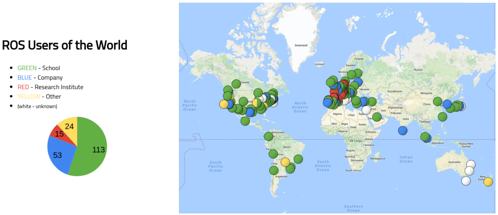
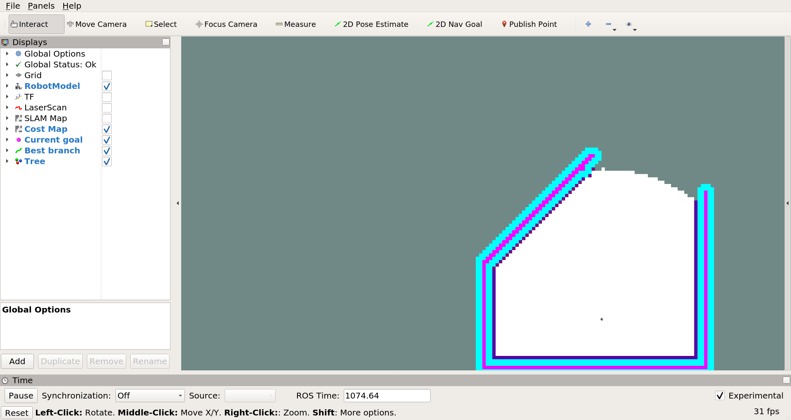
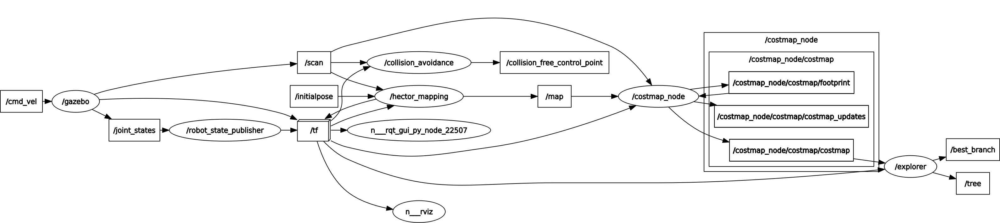
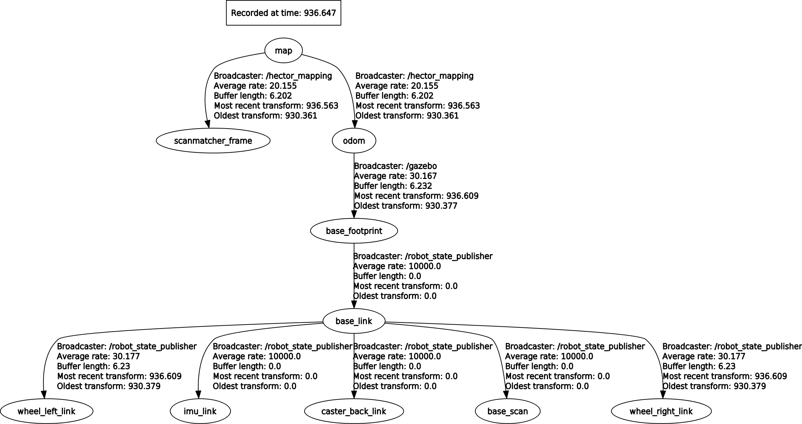

# Introduction to Robotics (DD2410)

## Assignment 1: Introduction to ROS

In this course we will be using the Robot Operating System (ROS). ROS is a middleware platform that provides libraries and tools that help software developers create robot applications. It simplifies the integration of different components on the same system and over the network.

### Why do we use ROS?



* Very large user community
* Standard in many robotics labs around the world, even in some companies
* Many commercially available robots use ROS nowadays
* Open source + large community = lots of packages, libraries, and tools available
  * Robot planning and control
  * Navigation
  * Visualization tools
  * Hardware drivers and interfaces
  * Etc ...
* Modularization and abstraction
* Standardization/structure
* Easier to collaborate with others
* Make roboticists' life easier

### Basic ROS concepts

ROS has a great wiki that you can find [here](http://wiki.ros.org/). There you can find basically everything about ROS, and it should be the first place you look when you have trouble with ROS. There is also a Q&A, like Stack Overflow but for ROS, [here](https://answers.ros.org/) where you can ask questions and find answers to other people's questions.

Since ROS already has a great wiki with tutorials and such, we will only briefly mention the most basic concepts here. You can then find more information in the ROS wiki as you please. We think this is a good way of teaching you ROS, since the most important skill for you in order to master ROS is to be able to find the information you need quickly in the ROS wiki.

* [Nodes](http://wiki.ros.org/Nodes): ROS nodes are executables, processes that perform computation. A node should perform a single well-defined task, such as motor control, localization, sensor processing, etc. In a typical system you have many nodes. Each running node is able to exchange information through _topics_ and _services_. A ROS node is written with the use of a ROS [client library](http://wiki.ros.org/Client%20Libraries), such as [roscpp](http://wiki.ros.org/roscpp) or [rospy](http://wiki.ros.org/rospy). In this course you will write all code in Python so you will be using rospy. Remember to [make your Python script executable](https://superuser.com/a/828740).
* [Master](http://wiki.ros.org/Master): The ROS Master is what allows nodes to be able to find each other and exchange messages, or invoke services. For a functional ROS system you have to have a ROS master running. To explicitly start the ROS Master you use the command `roscore`. A ROS Master is implicitly started when running the command `roslaunch`, if there is no ROS Master already running. We recommend that you always explicitly start the ROS Master, using `roscore`, such that you do not have to restart the whole system when restarting the _launch file_ that started the ROS Master implicitly.
* [Parameter Server](http://wiki.ros.org/Parameter%20Server): The Parameter Server allows you to store data as key-value pairs, which nodes can access. This is especially useful when writing nodes in C++, since it allows you to change a parameters value without recompiling the node. It also allows other people using your code to easier change a parameter value, without going into your code. The Parameter Server is part of the ROS Master.
* [Messages](http://wiki.ros.org/Messages): Nodes communicate with each other by passing messages. A message is simply a data structure that can be passed between nodes.
* [Topics](http://wiki.ros.org/Topics): Nodes can send out messages by _publishing_ the messages to a topic. Another node can then _subscribe_ to the same topic in order to receive the messages. For example, a camera node would publish camera images to some topic, a vision system can then subscribe to that topic in order to get the images. Topics implement many-to-many relationship, meaning there can be multiple _publishers_ and _subscribers_ on the same topic. For each topic there can only be one type of message that is being published. A single node can subscribe and publish to multiple different topics.
* [Services](http://wiki.ros.org/Services): The publish and subscribe model of topics is very flexible, sometimes, however, you want to be able to request something and get a response. Services implement a client-server relationship. One node here acts as a server and offers the service. Other nodes (or the same node) acts as clients and can use the service. A service is defined by a pair of messages, the _request_ message and the _response_ message. A service call is almost like a function call. You might have a path planning node that is offering a path planning service. Another node can then call that path planning service with a starting point and an end point as the request message and will in return get a response message containing the path from the starting point to the end point.
* [Bags](http://wiki.ros.org/Bags): Bags are a format for recording and playing back ROS message data. They allow you to test your algorithms on data without running the system. This can be especially useful when you are working in places where there is difficult or time consuming to collect new data every time you want to test a change to your algorithms.
* [Packages](http://wiki.ros.org/Packages): Pieces of software in ROS are bundled together and distributed through packages. They contain source code for nodes, message/service/parameters files, and build and install instructions.

You can (and probably should) read more about the [basic ROS concepts](http://wiki.ros.org/ROS/Concepts) in the ROS wiki.

### Higher level ROS concepts

Here we will describe some of the higher level ROS concepts. You can (and probably should) read more about the [higher level ROS concepts](http://wiki.ros.org/ROS/Higher-Level%20Concepts) in the ROS wiki.

#### [TF](https://wiki.ros.org/tf2)

Let's first take a step back and look at how to deal with coordinate systems in ROS. A coordinate system is defined by a frame of reference. You might for example say that your computer is 50 cm from the left edge of your table, and 40 cm from the bottom edge. This coordinate system uses the table's lower left corner as its frame of reference (its origin), but clearly, you could choose any arbitrary reference frame. Perhaps it would make more sense to locate your laptop with respect to the north-east corner of the room you are in. If you then know where the table is in the room, it should be trivial to calculate the position of your laptop in the room -- this is exactly what TF does for you. A more concretely robotics-related application is available in section 1 of [http://wiki.ros.org/navigation/Tutorials/RobotSetup/TF](http://wiki.ros.org/navigation/Tutorials/RobotSetup/TF). More exact terminology can be found on the ROS wiki's [TF terminology page](http://wiki.ros.org/tf2/Terminology).

In mobile robotics there are three important frames that (almost) always are present when working with ROS: the map frame, considered the "absolute" coordinate system in that it does not change over time; the odom frame, for odometry frame, whose origin typically is where the robot was powered on; and the base_link frame, which is the robot frame -- in other words, the robot is always at the origin of the base_link frame. [REP 105](https://www.ros.org/reps/rep-0105.html) (Links to an external site.) defines these, and also gives some naming conventions and semantics, as well as some additional common frames.

The picture below illustrates the relationship between the three frames mentioned above and some additional ones. A position x=(x, y, z) or a pose (x, y, z and three rotations about the body axes) can be expressed in any of the frames. However, one of them is usually more natural than the other. For example, your laptop is easier to locate with respect to the table than the room in the example above. In the image below, the location of the landmarks L1 and L2 are easier to express in the map frame, whereas the position of the camera_link is defined with respect to base_link (i.e. relative to the robot.) We can see from the graph that in order to know where the camera is in the map frame we also need to know where the robot is in the odom frame and the relation between the odom frame and the map frame. This requires a localization system, which estimates the pose of the robot in the map frame and therefore calculates the transform between map and odometry. We will see later how TF allows us to seamlessly move from frame to frame and thus make it possible to, for example, express the location of the landmarks in the base_link frame.


We recommend you to use the newer [TF2](https://wiki.ros.org/tf2) instead of the old [TF](https://wiki.ros.org/tf). However, things such as converting a quaternion to/from euler has not yet been implemented for the Python API of TF2, therefore you have to use TF in these situations. You can see an example of that [here](https://wiki.ros.org/tf2/Tutorials/Quaternions#Think_in_RPY_then_convert_to_quaternion).

#### [Actionlib](http://wiki.ros.org/actionlib)

Services are great, however sometimes you want to cancel a request to a service. For example if the service is taking too much time or if you noticed something in the environment that affects what you want to do.

It would also be great if you could get periodical feedback about the request. For example if you have a path planner you might be able to start moving along the path even before the whole path has been calculated.

This is where _actionlib_ comes in. It is like _services_ with the added ability for the client to cancel the request and for the server to send periodic feedback to the client.

Use __simple__ action server and client.

#### Visualization

ROS provides tools to visualize your data. They subscribe to your topics and display information.

##### [RViz](https://wiki.ros.org/rviz)

You can use RViz for general purpose visualization.

One of the most important tools in the ROS arsenal is _RViz_, the robot visualization tool. You can start RViz by running `rviz` in a terminal. At the top is the toolbar. Typically, you will use the "Interact" tool; it pans, zooms and pivots the camera in the main 3D view. On the left is the "displays" panel; for now, you will only have a grid indicating the ground plane. The displays are, as the name suggests, things that are displayed in the main view. On the right is the camera settings panel, for now it can be left alone. It allows you to do things like following the robot in third person, 2D map projection, orbiting, and more.

##### [RQT](https://wiki.ros.org/rqt)

You can use RQT for more specialized analysis. You can show the node graph, TF tree, plot data, publish to topics and call services, show debug messages, and much more. Check it out!

<!-- #### [Robot Model](http://wiki.ros.org/urdf) -->

### ROS cheat sheet

You can find a useful ROS cheat sheet [here](https://github.com/ros/cheatsheet/releases/). As you can see it is for ROS Indigo, however everything seems to be the same for Melodic.

### When you need help with ROS

There are a lot of nice tutorials and information on the ROS webpage. Always look there first for information on ROS/ROS Packages.

* [ROS wiki](https://wiki.ros.org/)
* [ROS Q/A](https://answers.ros.org/)
* [ROS tutorials](https://wiki.ros.org/ROS/Tutorials/)

## The practical part of the assignment

Now we will start with the practical part of the assignment.

### What we use in this course

* Ubuntu __18.04__
* ROS __Melodic__
* Python
  * Version 2.7
  * Default with ROS Melodic

If you are interested you can read more [here](http://www.ros.org/reps/rep-0003.html).

Everything is installed for you in computer labs:

* E building: Röd, Orange, Gul, Grön, Brun, Grå, Karmosin, Vit, Magenta
* D bulding: Spelhallen, Sporthallen

### Install, source, and create ROS workspace

#### Own computer

```bash
# Install ROS Melodic desktop full
sudo sh -c 'echo "deb http://packages.ros.org/ros/ubuntu $(lsb_release -sc) main" > /etc/apt/sources.list.d/ros-latest.list'

sudo apt-key adv --keyserver 'hkp://keyserver.ubuntu.com:80' --recv-key C1CF6E31E6BADE8868B172B4F42ED6FBAB17C654

sudo apt update

sudo apt install ros-melodic-desktop-full

sudo rosdep init

rosdep update

sudo apt install python-rosinstall python-rosinstall-generator python-wstool build-essential python-pip python-catkin-tools

# Install ROS packages and such for assignment 1

sudo apt install ros-melodic-ros-tutorials ros-melodic-turtlebot3 ros-melodic-turtlebot3-simulations ros-melodic-navigation libspatialindex-dev libqt4-dev

sudo apt install ros-melodic-rqt ros-melodic-rqt-common-plugins ros-melodic-turtlesim

sudo apt install ros-melodic-turtle-tf2 ros-melodic-tf2-tools ros-melodic-tf

pip install rtree sklearn
```

#### School computer

```bash
pip install rtree sklearn
cd ~
mkdir not
mv .nv .nvidia-settings-rc not
```

_The last line fixes an OpenGL problem that students with an old account would otherwise encounter._

#### For all

[Source ROS](https://wiki.ros.org/melodic/Installation/Ubuntu#melodic.2BAC8-Installation.2BAC8-DebEnvironment.Environment_setup):

```bash
echo "source /opt/ros/melodic/setup.bash" >> ~/.bashrc
source ~/.bashrc
```

[Create a ROS workspace](https://wiki.ros.org/ROS/Tutorials/InstallingandConfiguringROSEnvironment):

```bash
mkdir -p ~/catkin_ws/src
cd ~/catkin_ws/
catkin_make
echo "source ~/catkin_ws/devel/setup.bash" >> ~/.bashrc
source ~/.bashrc
```

### Recommended editor

I recommend that you use [VS Code](https://code.visualstudio.com/) with the extensions:

* [ROS](https://marketplace.visualstudio.com/items?itemName=ms-iot.vscode-ros)
* [Python](https://marketplace.visualstudio.com/items?itemName=ms-python.python)
* Other that you find useful...

You can of course just whichever editor you want. Here you can find more information about different integrated development environments (IDEs) and how they work with ROS: [https://wiki.ros.org/IDEs](https://wiki.ros.org/IDEs).

### Tutorials

#### Basic ROS tutorials

In order for you to get a practical understanding of ROS you should now do the beginner level core ROS tutorials that you can find [here](https://wiki.ros.org/ROS/Tutorials#Core_ROS_Tutorials).

We did 1 above so you can skip that one if you want. Since we are using Python you should therefore do:

* [3. Creating a ROS Package](https://wiki.ros.org/ROS/Tutorials/CreatingPackage)
* [4. Building a ROS Package](https://wiki.ros.org/ROS/Tutorials/BuildingPackages)
* [12. Writing a Simple Publisher and Subscriber (Python)](https://wiki.ros.org/ROS/Tutorials/WritingPublisherSubscriber%28python%29)
* [15. Writing a Simple Service and Client (Python)](https://wiki.ros.org/ROS/Tutorials/WritingServiceClient%28python%29)

##### OPTIONAL tutorials

To get a deeper understanding, or if you get stuck later on, it might be a good idea to also do:

* [2. Navigating the ROS Filesystem](https://wiki.ros.org/ROS/Tutorials/NavigatingTheFilesystem)
* [5. Understanding ROS Nodes](https://wiki.ros.org/ROS/Tutorials/UnderstandingNodes)
* [6. Understanding ROS Topics](https://wiki.ros.org/ROS/Tutorials/UnderstandingTopics)
* [7. Understanding ROS Services and Parameters](https://wiki.ros.org/ROS/Tutorials/UnderstandingServicesParams)
* [8. Using rqt_console and roslaunch](https://wiki.ros.org/ROS/Tutorials/UsingRqtconsoleRoslaunch)
* [9. Using rosed to edit files in ROS](https://wiki.ros.org/ROS/Tutorials/UsingRosEd)
* [10. Creating a ROS msg and srv](https://wiki.ros.org/ROS/Tutorials/CreatingMsgAndSrv)
* [13. Examining the Simple Publisher and Subscriber](https://wiki.ros.org/ROS/Tutorials/ExaminingPublisherSubscriber)
* [16. Examining the Simple Service and Client](https://wiki.ros.org/ROS/Tutorials/ExaminingServiceClient)
* [17. Recording and playing back data](https://wiki.ros.org/ROS/Tutorials/Recording%20and%20playing%20back%20data)
* [18. Getting started with roswtf](https://wiki.ros.org/ROS/Tutorials/Getting%20started%20with%20roswtf)
* [19. Navigating the ROS wiki](https://wiki.ros.org/ROS/Tutorials/NavigatingTheWiki)

If you want you may also do the intermediate level tutorials and/or the C++ tutorials.

#### TF2 tutorials

The TF library in ROS is very useful when you are building real systems. Therefore we feel it is important that you get to try it out. You should therefore do the [TF2 tutorials](https://wiki.ros.org/tf2/Tutorials) for Python.

You should do at least:

* [1. Introduction to tf2](https://wiki.ros.org/tf2/Tutorials/Introduction%20to%20tf2)
* [1. Writing a tf2 static broadcaster (Python)](https://wiki.ros.org/tf2/Tutorials/Writing%20a%20tf2%20static%20broadcaster%20%28Python%29)
* [2. Writing a tf2 broadcaster (Python)](https://wiki.ros.org/tf2/Tutorials/Writing%20a%20tf2%20broadcaster%20%28Python%29)
* [3. Writing a tf2 listener (Python)](https://wiki.ros.org/tf2/Tutorials/Writing%20a%20tf2%20listener%20%28Python%29)

##### Optional tutorials

To get a deeper understanding, or if you get stuck later on, it might be a good idea to also do:

* [4. Adding a frame (Python)](https://wiki.ros.org/tf2/Tutorials/Adding%20a%20frame%20%28Python%29)
* [5. Learning about tf2 and time (Python)](https://wiki.ros.org/tf2/Tutorials/tf2%20and%20time%20%28Python%29)
* [6. Time travel with tf2 (Python)](https://wiki.ros.org/tf2/Tutorials/Time%20travel%20with%20tf2%20%28Python%29)
* [1. Quaternion Basics](https://wiki.ros.org/tf2/Tutorials/Quaternions)

You can of course do the other tutorials as well.

#### Actionlib tutorials

Actionlib is useful when you have something that you want to function as a service but with the abilities to send intermediate results and cancel the request.

An example for when actionlib is useful. Imagine that you have a path following node that provides a path following _service_. Once another node has made a request on the path following _service_ the path planning node will execute the whole path. But what happens if you see something along the way and want to do something else based on that? Well, if you use a _service_ you cannot do much other than wait until the path follower has reached the end of the path. If the path following node instead had provided a path following _action_ then the other node would have been able to cancel the request once you saw something interesting, and the robot would therefore stop following the path.

You should do at least these actionlib tutorials:

* [4. Writing a Simple Action Server using the Execute Callback (Python)](https://wiki.ros.org/actionlib_tutorials/Tutorials/Writing%20a%20Simple%20Action%20Server%20using%20the%20Execute%20Callback%20%28Python%29)
* [5. Writing a Simple Action Client (Python)](https://wiki.ros.org/actionlib_tutorials/Tutorials/Writing%20a%20Simple%20Action%20Client%20%28Python%29)

Detailed description of actionlib: [https://wiki.ros.org/actionlib/DetailedDescription](https://wiki.ros.org/actionlib/DetailedDescription)

### Mini-project

#### Installation

```bash
cd ~/catkin_ws/
wstool init src
cd ~/catkin_ws/src
wstool set -y irob_assignment_1 --git https://github.com/danielduberg/irob_assignment_1.git -v master
wstool set -y hector_slam --git https://github.com/tu-darmstadt-ros-pkg/hector_slam.git -v melodic-devel
wstool update
cd ~/catkin_ws
# This makes sure we compile in release mode (which means that the compiler optimizes the code)
catkin_make -DCMAKE_BUILD_TYPE=RelWithDebInfo
source ~/.bashrc
```

#### Description

You will now do a mini-project where you should help a [TurtleBot3](http://emanual.robotis.com/docs/en/platform/turtlebot3/overview/) robot explore an unknown environment. The robot is called Burger and you can see a picture of Burger below.


Image taken from: [http://emanual.robotis.com/docs/en/platform/turtlebot3/specifications/#data-of-turtlebot3-burger](http://emanual.robotis.com/docs/en/platform/turtlebot3/specifications/#data-of-turtlebot3-burger)

The ability to perform autonomous exploration is essential for an autonomous system operating in unstructured or unknown environments where it is hard or even impossible to describe the environment beforehand.

#### System description

Luckily for you, you do not have to solve the whole exploration task. Instead you will use an _exploration_ node, based on [receding horizon "next-best-view" (RH-NBV)](https://ieeexplore.ieee.org/abstract/document/7487281), that we have prepared for you. You will also make use of a _collision avoidance_ node, based on [the obstacle-restriction method (ORM)](https://ieeexplore.ieee.org/abstract/document/1545546) and [pure pursuit](https://apps.dtic.mil/docs/citations/ADA255524) (for smooth control), that ensures safe path following. In order for Burger to localize herself/himself you will also run a _SLAM_ node, based on [Hector SLAM](https://wiki.ros.org/hector_slam), which does mapping and localization. We will also make use of a [_costmap_2d_](https://wiki.ros.org/costmap_2d) node in order to make the exploration and collision avoidance simpler. Since you are not given a real Burger robot we will do this in simulation. The simulator we use is called [Gazebo](http://gazebosim.org/) and it is a popular simulator when working with ROS. Lastly, we will use a [_robot_state_publisher_](https://wiki.ros.org/robot_state_publisher) node to get the necessary transformations.

What you will have to do is create a _controller_ node that is using the exploration node and the collision avoidance node in order to move Burger around in the environment. This is one of the best things about ROS. That you do not have to do everything yourself. Instead you can use what others have done and simply "glue" the pieces together to make your desired system work.

#### Let's start

Open three terminals.

In the first terminal you should start the ROS Master:

```bash
roscore
```

In the second terminal you should launch the file `simulator.launch` inside `irob_assignment_1/launch` like this:

```bash
roslaunch irob_assignment_1 simulator.launch
```

And in the third terminal launch the file `start.launch` inside `irob_assignment_1/launch` like this:

```bash
roslaunch irob_assignment_1 start.launch
```

You will see a window called [RViz](https://wiki.ros.org/rviz) open:



In the main view of the RViz window you can see a small Turtlebot3 Burger robot in the middle of the white area. The white area of the map is called _free space_, it is space where the robot knows there is nothing. The large gray area is _unknown space_, it is space that the robot knowns nothing about. It can be either _free space_ or _occupied space_. _Occupied space_ is the cerise colored space. The cyan colored space is called _C-space_, it is space that are a distance from the _occupied space_ such that the robot would collied with the _occupied space_ if it would move into it. Take a look at the image below if you are interested. You can read more about it [here](https://wiki.ros.org/costmap_2d). Your job will be to help Burger explore as much of the _unknown space_ as possible.


Image taken from: [https://wiki.ros.org/costmap_2d](https://wiki.ros.org/costmap_2d)

If you open up [RQT](https://wiki.ros.org/rqt):

```bash
rqt
```

Then in the topbar select `Plugins->Introspection->Node Graph` and uncheck `Leaf topics`, you will see something like this:



Here you can see all of the nodes that were started when you ran the `roslaunch` commands before, and that we talked about previously. There are two nodes of interest for you here. The `/explore` node and the `/collision_avoidance` node.

The `/explore` node is providing an action server called `get_next_goal` with the type `irob_assignment_1/GetNextGoalAction`. If we take a look at the action definition:

```bash
# Goal definition
---
# Result definition
float64 gain
nav_msgs/Path path
---
# Feedback definition
float64 gain
nav_msgs/Path path
```

We see that in the request it does not require anything. So when you call this action server, you do not have to supply any arguments. The result you will get from the action server is a `gain` value and a `path`. The `gain` value tells you how valuable the `path` is. It is often how much new space you will discover when moving along the corresponding path.

In the feedback you can see that you, once again, get `gain` and a `path`. The longer the exploration algorithm is running the better path -- one with higher gain -- it will find. However, it is not always worth the time it takes to find the best path. So since you get a path with an associated gain, you might want to stop the exploration once you get a path with a `gain` higher than a certain value. You are not require to do this to pass this assignment, it is optional.

Okay, so lets say you have now called the explore action server and gotten a path. Now you want the robot to move along the path. You also do not want the robot to crash while following the path. Therefore we should now take a look at the `collision avoidance` node.

The collision avoidance node is providing a service called `get_setpoint` of type `irob_assignment_1/GetSetpoint`. If you type:

```bash
rossrv show irob_assignment_1/GetSetpoint
```

You will see the request and response messages:

```bash
# Define the request
nav_msgs/Path path
---
# Define the response
geometry_msgs/PointStamped setpoint
nav_msgs/Path new_path
```

You can see that the service wants a path, which is perfect because that is exactly what you got from the exploration action server. In return you will get a setpoint of type `geometry_msgs/PointStamped` and a new path. You get a new path since the collision avoidance node is removing points along the path which is thinks you have already moved passed. The `setpoint` is where you should move the robot next to follow the path in a safe and efficient way.

If we take a look at the setpoint message:

```bash
rosmsg show geometry_msgs/PointStamped
```

We see:

```bash
std_msgs/Header header
  uint32 seq
  time stamp
  string frame_id
geometry_msgs/Point point
  float64 x
  float64 y
  float64 z
```

The `header` tells you in which frame the `point` is in. If you print the frame:

```python
rospy.loginfo("The frame is: %s" setpoint.header.frame_id)
```

You will see that the point is specified in the X (where X is the frame you get) frame.

Okay, so now you have the point and you know which frame it is in. How do we make the robot move?

If we take a look at the topics list:

```bash
rostopic list
```

You should be able to find a topic called `/cmd_vel`. It sounds interesting, maybe it means "command velociy"? We want more info about the topic so we write:

```bash
rostopic info /cmd_vel
```

And it will output something like:

```bash
Type: geometry_msgs/Twist

Publishers: None

Subscribers: 
 * /gazebo (http://X:YYYYY/)
```

Here we see that there is one subscriber to the topic and no publisher. We also see that the message type that is communicated over the topic is called `geometry_msgs/Twist`. We take a look at the message definition:

```bash
rosmsg show geometry_msgs/Twist
```

And we get:

```bash
geometry_msgs/Vector3 linear
  float64 x
  float64 y
  float64 z
geometry_msgs/Vector3 angular
  float64 x
  float64 y
  float64 z
```

So the `geometry_msgs/Twist` message consist of a linear and angular velocity. Burger is a differential drive robot. Meaning Burger can only move forward/backward and rotate. To move forward `linear.x` should be positive. To move backwards it would be negative. To rotate you change the value of "angular.z", then the robot will be "yawing", rotating around the z-axis. Changing `linear.y, linear.z, angular.x, and angular.y` has no effect on the robot.

We can also see that the `geometry_msgs/Twist` message does not contain a `header`, therefore the subscriber to the `/cmd_vel` topic has no idea in what frame of reference the incoming velocity command has. Instead the subscriber assumes that the velocity command is in the robots frame.

Take a look at the TF tree by running the command `rqt`, to start RQT, then in the top bar select `Pluings->Visualization->TF Tree`:



The robots frame is often called `base_link` and it is in this mini-project as well. So this is the frame the subscriber on the `/cmd_vel` topic is expecting the velocity command to be specified in. So if the setpoint you got from the `get_setpoint` service is not in the `base_link` frame then you have to transform it using TF2 to `base_link`.

After you have transformed the setpoint to `base_link` you should now convert the setpoint from a `geometry_msgs/PointStamped` message to a `geometry_msgs/Twist` message and publish it on the `/cmd_vel` topic. If you did the TF2 tutorial on writing a [tf2 listener](https://wiki.ros.org/tf2/Tutorials/Writing%20a%20tf2%20listener%20%28Python%29) you should have a good idea about how to convert the `geometry_msgs/PointStamped` to a `geometry_msgs/Twist`. __Remember__ that you should transform the setpoint, so you cannot do exactly as it says in the TF2 tutorial. It is a good idea to use the function:

```python
transformed_setpoint = tf2_geometry_msgs.do_transform_point(setpoint, transform)
```

When transforming the setpoint using the transform you got from:

```python
transform = tf_buffer.lookup_transform(...)
```

It can be a good idea to limit the linear and angular velocities, otherwise the robot will act strange. These seem to be good values:

```python
max_linear_velocity = 0.5
max_angular_velocity = 1.0
```

But you are free to try other values.

Then after that you should again call the `get_setpoint` with the `new_path` you got from the service the last time you called it, and then you do the same thing to transform and publish the new setpoint. You do this until the `new_path` does not contain any poses:

```python
while new_path.poses:
```

When that happens you should call the explore action server again to get a new path, and do everything over again until the action server returns an empty path and/or the gain is 0, meaning there is nothing new to explore.

It can be a good idea to limit the frequency of publishing to `/cmd_vel` to somewhere between 10 to 20. You can do that using the `rospy.Rate(X)` and then `rate.sleep()` as you did in the tutorials.

You can do the assignment using two different approaches:

#### Simple approach

If you go into the folder `irob_assignment_1/scripts` you will see a file called `controller.py`. Here we have made a skeleton for the controller node that you should write. So create your controller node in that file. When you are done you can test your controller by running:

```bash
rosrun irob_assignment_1 controller.py
```

If your code does not work yet, or you want to restart you simply have to close down your node and `start.launch` by going to the terminal where you started `start.launch` and press `CTRL+C`. Thereafter you launch the `start.launch` again:

```bash
roslaunch irob_assignment_1 start.launch
```

Together with your node in a seperate terminal:

```bash
rosrun irob_assignment_1 controller.py
```

Note that you do __not__ have to restart `roscore` or `simulator.launch`.

__Pseudocode__ for the assignment:

```python
# Init stuff
while True:
    path, gain = get_path_from_action_server()
    if path is empty:
        exit() # Done
    while path is not empty:
      path, setpoint = get_updated_path_and_setpoint_from_service(path)
      setpoint_transformed = transform_setpoint_to_robot_frame(setpoint)
      publish(setpoint_transformed)
      sleep()
```

You should be able to implement this in around __80-100 lines of Python code__. You should not need to import anything else or declare any other global variables then the once we provided in the skeleton. Of course you are allowed to do that if you want.

Sometimes you will see the robot getting stuck in walls. It is because the collision avoidance system was developed for a holonomic robot. To prevent this from happening it can be a good idea to set the linear velocity to 0 when Burger has to do a lot of turning. For example when the angular velocity is equal (or almost equal) to the maximum angular velocity you chose (1.0 if you want the same value as I used). This ensures that Burger follows the path more closely.

What you should see if you have done everything correct:

[](https://www.youtube.com/watch?v=L-Q_F20LVxU)

#### OPTIONAL: Callback based approach

If you did the mini-project using the simple approach you will notice that the exploration is quite slow and that Burger is just standing still a lot. This is because we are not using Actionlib to it's full potential. We are simply using the action server as a service.

To utilize Actionlib fully we have to use the _callback based action client_. Sadly, there is not a tutorial for a callback based action client written in Python on the Actionlib tutorial page. Therefore I will give you a minimal example of __Callback Based SimpleActionClient__ written in Python here:

```python
#!/usr/bin/env python2
import rospy
import actionlib
import irob_assignment_1.msg

goal_client = None

def goal_active():
    rospy.loginfo("I got activated")


def goal_feedback(feedback):
    rospy.loginfo("I got feedback")

    # TODO: Do your stuff


def goal_result(state, result):
    if actionlib.TerminalState.SUCCEEDED == state:
        rospy.loginfo("Action returned succeeded")

        # TODO: Do your stuff

    elif actionlib.TerminalState.RECALLED == state:
        rospy.loginfo("Action returned recalled")
    elif actionlib.TerminalState.REJECTED == state:
        rospy.loginfo("Action returned rejected")
    elif actionlib.TerminalState.PREEMPTED = state:
        rospy.loginfo("Action returned preempted")
    elif actionlib.TerminalState.ABORTED = state:
        rospy.loginfo("Action returned aborted")
    elif actionlib.TerminalState.LOST = state:
        rospy.loginfo("Action returned lost")


def get_path():
    global goal_client
    goal_client.wait_for_server()
    goal = irob_assignment_1.msg.GetNextGoalGoal()
    goal_client.send_goal(goal, active_cb=goal_active,
                          feedback_cb=goal_feedback, done_cb=goal_result)


if __name__ == "__main__":
    rospy.init_node("controller")

    # Action client
    goal_client = actionlib.SimpleActionClient(
        "get_next_goal", irob_assignment_1.msg.GetNextGoalAction)

    get_path()

    rospy.spin()
```

The difference from the none callback based action client is that we specify three callback functions when calling send_goal:

* `active_cb`: This will be called as soon as the goal has been sent to the server.
* `feedback_cb`: This will be called every time the server sends feedback to the client.
* `done_cb`: This will be called when the server is done with the goal, when the client cancel the goal, or an error happens during processing of the goal.

As you can see we also do not `wait_for_result()` or `get_result()` since we will get the feedback or result as soon as it is available in the `feedback_cb` or `done_cb` callback, respectively.

You can find a code skeleton for the callback based approach in file controller_feedback.py in the folder `irob_assignment_/scripts`. To run it you type in the terminal:

```bash
rosrun irob_assignment_1 controller_feedback.py
```

How can you use the __Callback Based SimpleActionClient__ in order to increase the speed of the exploration? You can implement the assignment with __Callback Based SimpleActionClient__ in __less than 100 lines of Python code__.

What you should see if you have done everything correct:

[](https://www.youtube.com/watch?v=m3NzMTdnsZU)

#### The presentation

The important part of this assignment is not that you write superb code. What we want you to focus on is to understand ROS.

You should be able to explain the different ROS concepts, nodes, topics, services, messages, actionlib, ect. You should be able to explain all lines in your code: why do you need a `rospy.init_node(...)`? What does `pub = rospy.Publisher(...)` and `pub.publish(...)` do? What is the `queue_size` parameter used for when you are calling `rospy.Publisher(...)`?

#### (Will be) Frequently Asked Questions

##### Which TF functions should I use to complete the mini-project?

I did it with `tf_buffer.lookup_transform(...)` and `tf2_geometry_msgs.do_transform_point(...)`.

##### My robot moves weird in the mini-project, why?

Did you set a maximum linear and angular velocity? 0.5 and 1.0, respectively, should work. Also consider setting the linear velocity to 0 if the angular velocity is high (close to your maximum).

##### How do I get the angle to the setpoint?

Math. Use: `math.atan2(y, x)`.

##### The TF says something about extrapolating into the past, why?

Probably because you did not initilize the TF buffer such that it has the transforms, like this:

```python
# Imports

# Global variables

tf_buffer = None
listener = None

# Your other functions

if __name__ == "__main__":
    rospy.init_node("controller")

    # Other stuff you want to init

    # Create TF buffer
    tf_buffer = tf2_ros.Buffer()
    listener = tf2_ros.TransformListener(tf_buffer)

    # Function calls and such

    rospy.spin()

```

You should do this in the beginning (right after `rospy.init_node(...)`) such that it has time to buffer the transforms.

##### The TF says something about extrapolating into the future, why?

Probably because you are trying to get a transform that is not yet available. TF2 cannot extrapolate, only interpolate.

You can use these inside `tf_buffer.lookup_transform(...)`:
`rospy.Time(0)` to get the most recent transform and `rospy.Duration(1)` to wait for 1 second if that is needed.

##### Why is the exploration so slow?

You probably did not use the Callback Based SimpleActionClient. Implement it using Callback Based SimpleActionClient instead. In the feedback callback you can see if the current `gain` is over, for example, 3 (or some other value that you find is good) and then cancel the goal if that is the case.

##### I am trying to cancel the goal but it is not working :(

Try to cancel all the goals using `goal_client.cancel_all_goals()`.

##### I implemented the Callback Based SimpleActionClient, but it is not working :(

Did you actually cancel the request after you got a feedback with high enough gain? When you cancel the request you will get a result `actionlib.TerminalState.PREEMPTED`, so be sure that in the result callback that you only do something if the state is `actionlib.TerminalState.SUCCEEDED`.

##### I get an error when launching the simulation

If you get an error like this when starting the simulation:

```bash
[ERROR] [1566203746.351834242, 923.389000000]: Transform failed during publishing of map_odom transform: Lookup would require extrapolation into the past.  Requested time 922.885000000 but the earliest data is at time 922.951000000, when looking up transform from frame [base_footprint] to frame [odom]
```

Do not worry about it. It is fine. It is because the SLAM system is trying to use a transform that does not exist yet.

##### I get an other error when launching the simulation

If you get an error like this when starting the simulation:

```bash
[gazebo-1] process has died [pid 6639, exit code 255, cmd /opt/ros/melodic/lib/gazebo_ros/gzserver -e ode /home/dduberg/catkin_ws/src/irob_assignment_1/worlds/office.world __name:=gazebo __log:=/home/dduberg/.ros/log/18af60ee-c01f-11e9-98f6-b06ebf6030aa/gazebo-1.log].
log file: /home/dduberg/.ros/log/18af60ee-c01f-11e9-98f6-b06ebf6030aa/gazebo-1*.log
```

It means that Gazebo crashed and you have to restart the simulation. Sadly, this happens sometime.

##### It takes a long time for RViz and/or Gazebo to load/start

Run these commands:

```bash
cd ~
mkdir not
mv .nv .nvidia-settings-rc not
```
